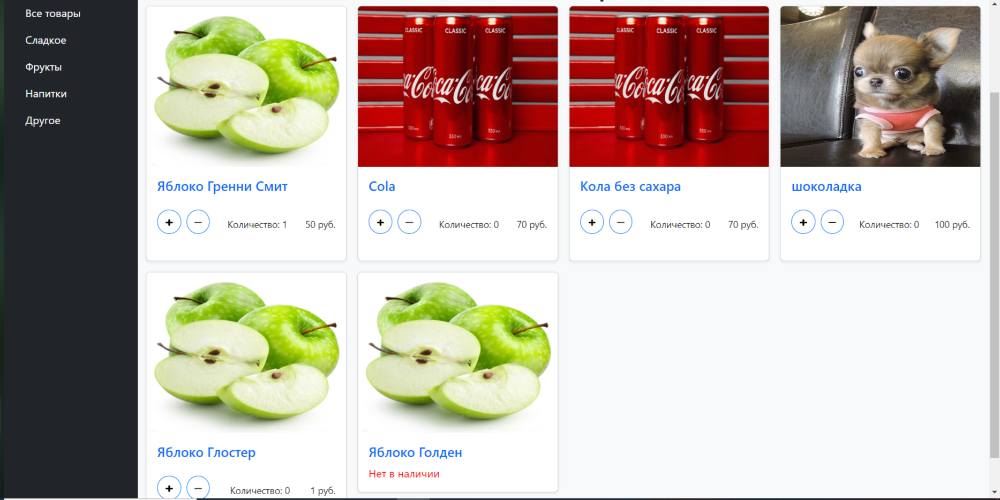

# Shop-DRF
Онлайн-магазин.
## Описание
На сайте можно взаимодействовать с корзиной, совершать оплату выбранных товаров, присутствует возможность просмотра карточки товара и поиска.

## Стек технологий
- backend: Django, DRF, SQLite
- frontend: ReactJS

## Запуск
- Склонировать репозиторий
- в файле frontend/.env поменять адрес API, если необходимо
- Запустить API из корневой папки проекта `python manage.py runserver`
- Запустить клиентскую часть из директории ./frontend `npm start` **Автоматически открытая страница работает с багами. Следует закрыть и открыть ее заново**

